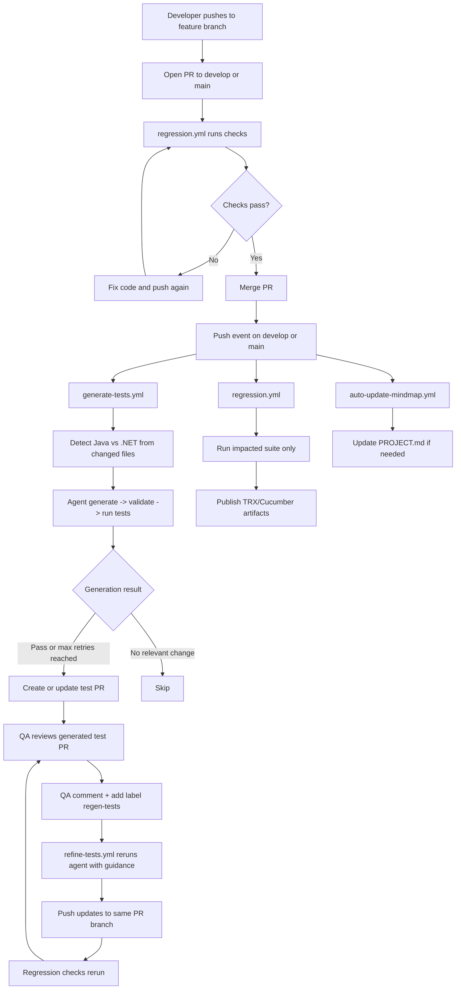

# AI-Generated Regression Tests

This project keeps a **BDD regression test suite** in sync with your API code — automatically.

When you change the code and push, an AI agent looks at the git diff, figures out what
behavior changed, and writes the matching tests. It even runs the tests it wrote, and if
they fail, it reads the errors and tries again. When the tests pass, it opens a pull
request for you to review.

It works for **two kinds of projects**, and picks the right one automatically:

| Your code | Tests it writes | Framework |
|---|---|---|
| **Java** (Spring Boot) | Cucumber `.feature` files + Java step definitions | Cucumber + JUnit |
| **.NET** (ASP.NET Core) | SpecFlow `.feature` files + C# step definitions | SpecFlow + xUnit |

## How it works (the short version)

```
You change API code and push
        │
        ▼
1. The agent reads the git diff
   → Sees .cs files changed?   → it's a .NET run
   → Sees .java files changed? → it's a Java run
        │
        ▼
2. It gathers context
   (the source code, the existing tests, existing step definitions)
        │
        ▼
3. An LLM writes the new/updated tests
   (Gherkin scenarios + any new step-definition "glue" code)
        │
        ▼
4. It checks the tests are valid
   (every step has matching glue, paths are correct, etc.)
        │
        ▼
5. It RUNS the tests  (mvn test for Java, dotnet test for .NET)
   → Pass?  → open a pull request ✅
   → Fail?  → read the errors, rewrite, and try again (up to 3 times)
```

The key idea: **the agent doesn't just guess — it runs what it wrote and self-corrects.**

## What's in this repo

| Path | What it is |
|---|---|
| `java-component/` | A sample Spring Boot API (products, orders, reviews) — the Java code under test |
| `dotnet-component/` | A sample ASP.NET Core API (products) — the .NET code under test |
| `testgen-agent/` | The Python AI agent that writes the tests (built with LangGraph) |
| `dashboard/` | A small web dashboard that shows pipeline runs (see `dashboard/README.md`) |
| `demo/` | Scripted example changes you can push to watch the pipeline work (see `demo/RUNBOOK.md`) |
| `.github/workflows/` | The GitHub Actions that run the agent and the regression suite |

The tests the agent maintains live in:
- Java: `java-component/src/test/resources/features/` (+ glue in `src/test/java/.../cucumber/`)
- .NET: `dotnet-component/Tests/Features/` (+ glue in `dotnet-component/Tests/StepDefinitions/`)

## The GitHub workflows

| Workflow | What it does | When it runs |
|---|---|---|
| `generate-tests.yml` | Runs the AI agent, opens a PR with new/updated tests | You push code changes to `main` (or run it manually) |
| `regression.yml` | Runs the existing test suite to confirm code and tests still match | Any push or PR that touches `java-component/` or `dotnet-component/` |
| `auto-update-mindmap.yml` | Keeps `PROJECT.md` (a human-readable knowledge base) up to date | On pushes that change controllers/services/features |

### Detailed CI + refinement flow



Note: the refinement trigger label is `regen-tests`.

**Why two main workflows?** `generate-tests` *writes* the tests; `regression` *checks* them.
The agent's own PRs are checked by `regression` before you merge — so a broken generated
test can't sneak in.

## The agent, step by step

The agent is a small state machine (LangGraph). Each step feeds the next:

`collect_diff → gather_context → generate_tests → validate_output → write_features → run_generated_tests → create_pull_request`

- **collect_diff** — runs `git diff` and decides the language. `.cs`/`.csproj` changes → .NET;
  `.java` changes → Java. If nothing relevant changed, it stops early.
- **gather_context** — reads the changed source, the existing feature files, and the existing
  step definitions, so the model knows what already exists and can reuse it.
- **generate_tests** — asks the LLM (through OpenRouter) to write the tests. It uses a simple
  block format (raw file contents between `=== ... ===` markers) instead of JSON, because free
  models often break when escaping source code into JSON.
  **Model fallback:** if a model is rate-limited (HTTP 429), it immediately tries the **next**
  model in the list, and only waits/retries the whole set if *every* model is busy. (This was a
  real bug once — it used to give up after the first model. Now it tries them all.)
- **validate_output** — structural checks before running anything: every Gherkin step must have
  matching glue, Scenario Outlines must have Examples, file paths must be in the right place for
  the detected language, etc. Problems are fed back to the model to fix.
- **run_generated_tests** — the important one. It actually runs the tests:
  - Java → `mvn test`, then reads compile errors and per-scenario Cucumber failures.
  - .NET → `dotnet test`, then reads compile errors and per-scenario failures from the TRX report.

  If anything fails, it feeds the exact errors back to the model and regenerates — up to 3 times.
  This catches the *meaning* mistakes that structure checks can't: a wrong expected value, a bad
  status code, glue that doesn't compile. (If Maven or the dotnet CLI isn't installed, this step
  is skipped gracefully instead of blocking.)
- **create_pull_request** — commits the tests to a new branch and opens a PR via the `gh` CLI.
  The PR says whether the tests passed. If they still fail after 3 tries, it opens the PR anyway
  but **flags it as failing** — so the work isn't lost and a human can take over.

## Running the agent yourself

```bash
cd testgen-agent
python3 -m venv .venv && .venv/bin/pip install -r requirements.txt
export OPENROUTER_API_KEY=...        # required

# Dry run: write the test files locally, but don't commit or open a PR
.venv/bin/python main.py --repo .. --base HEAD~1 --head HEAD --no-pr

# Full run: also commit to a branch and open a PR (needs a GitHub remote + gh login)
.venv/bin/python main.py --repo .. --base HEAD~1 --head HEAD
```

Run the agent's own unit tests:

```bash
cd testgen-agent
.venv/bin/python -m pytest        # or: .venv/bin/python -m unittest discover tests
```

## Running the regression suites yourself

```bash
# Java  (needs JDK 17+ — point JAVA_HOME at 17 if mvn picks an older one)
mvn -f java-component/pom.xml verify
#   → HTML report: java-component/target/cucumber-report.html

# .NET  (needs the .NET 9 SDK)
dotnet test dotnet-component/BP.Tests.csproj
```

## Configuration (environment variables)

| Variable | Default | What it does |
|---|---|---|
| `OPENROUTER_API_KEY` | — | **Required.** Your OpenRouter key |
| `TESTGEN_MODEL` | `openai/gpt-oss-120b:free` | First model to try |
| `TESTGEN_MODELS` | — | Comma-separated list to replace the whole fallback chain |
| `TESTGEN_MODEL_RETRIES` | `3` | How many full passes over the model list before giving up |
| `TESTGEN_MAX_ATTEMPTS` | `6` | Safety cap on generate→validate retries |
| `TESTGEN_MAX_TEST_ATTEMPTS` | `3` | How many times to rerun-and-fix after a test failure |
| `TESTGEN_MAX_CONTEXT_CHARS` | `60000` | Max characters of context per section |
| `MAVEN_CMD` | `mvn` | Maven binary (Java loop is skipped if not found) |
| `TESTGEN_COMPONENT_DIR` | `java-component` | Which Java component's `mvn test` runs |

**Tip:** the free models are shared and often rate-limited. For reliable runs, use a funded
OpenRouter key or point `TESTGEN_MODEL` at a stronger paid model, e.g.
`anthropic/claude-haiku-4.5`.

## Setting it up in CI

1. Push this repo to GitHub.
2. Add `OPENROUTER_API_KEY` as a repository secret
   (Settings → Secrets and variables → Actions).
3. Let Actions open PRs
   (Settings → Actions → General → "Allow GitHub Actions to create and approve pull requests").

## Optional: Azure DevOps ticket context

If a change is tied to an ADO work item, the agent can pull the ticket's title, description,
and acceptance criteria into the prompt and the PR body. Add these repo secrets:

- `AZDO_ORG_URL` — e.g. `https://dev.azure.com/your-org`
- `AZDO_PROJECT` — your project name
- `AZDO_PAT` — a PAT with work-item read access

Mention the work item in your commit message as `AB#1234`, `ADO-1234`, or `WI-1234`, or set
`AZDO_WORK_ITEM_ID` when running the workflow manually.

## Reviewing a generated PR

Treat the AI's tests like a junior engineer's — helpful, but check them:

- ✅ **Is the regression check green?** Never merge a red one.
- ✅ **Do the expected values match the code exactly?** Error messages, boundary numbers
  (`> 100` vs `>= 100`), and computed totals are where models slip.
- ✅ **Is anything missing?** Each changed endpoint should have happy-path *and* error-path scenarios.
- ✅ **Does new glue reuse the shared test context** (the "last created product" pattern) rather
  than private fields?

## What it can and can't do

**Good at:** small, focused changes — roughly **1–3 endpoints' worth of new behavior per push**.
It handles a validation rule, a new status code, or a new endpoint well.

**Struggles with:** many interacting business rules in one big diff. It's *behavioral density*
that matters, not diff size — a 3,000-line rename with no API change is handled fine ("nothing
observable changed, no tests needed"), but a 40-line diff adding three tangled pricing rules is
the hard case. For big changes, merge one feature at a time.

**Only a human can catch:** values that are *plausible but wrong* (a boundary on the wrong side,
an approximated error message), and tests that accidentally "bless" a bug as intended behavior.
That's what the review checklist above is for.

**Other limits:**
- Generation is a single LLM call, so very large context gets truncated
  (`TESTGEN_MAX_CONTEXT_CHARS`).
- Free OpenRouter models can be rate-limited or removed without notice; the fallback chain
  absorbs most of it, but a busy hour can still fail a run (just re-run it).
- It reacts to code changes, not config changes (`application.yml`, SQL, etc. are invisible to it).

## About PROJECT.md (the "mind map")

`PROJECT.md` is an auto-generated, human-readable summary of the codebase's endpoints, services,
and test coverage. It's updated by `update-project-mindmap.py` and the `auto-update-mindmap.yml`
workflow whenever controllers/services/features change.

**Note:** this is a convenience document for humans — the agent does **not** currently read it as
input. It's kept as a living overview and audit trail, not as a required part of the pipeline.

Update it manually anytime:

```bash
python3 update-project-mindmap.py               # just update the file
python3 update-project-mindmap.py --auto-commit # update and commit
```

To enable the local pre-commit hook that keeps it fresh: run `./setup-hooks.sh`
(Mac/Linux) or `setup-hooks.bat` (Windows).

## Troubleshooting

**.NET: `The type or namespace 'TechTalk' could not be found`**
The SpecFlow files aren't wired into the project. Make sure `BP.Tests.csproj` includes:
```xml
<ItemGroup>
  <Compile Include="Tests/**/*.cs" />
</ItemGroup>
<ItemGroup>
  <SpecFlowFeatureFiles Include="Tests/Features/**/*.feature" />
</ItemGroup>
```
Then `dotnet clean && dotnet build && dotnet test`.

**Java: `mvn: command not found`**
Install Maven (`brew install maven` / `sudo apt-get install maven` / `choco install maven`), or
set `MAVEN_HOME` and add it to your `PATH`.

**A run failed with "All models exhausted (429)"**
The free model pool was busy. Re-run the workflow, or switch to a funded key / paid model via
`TESTGEN_MODEL`.
